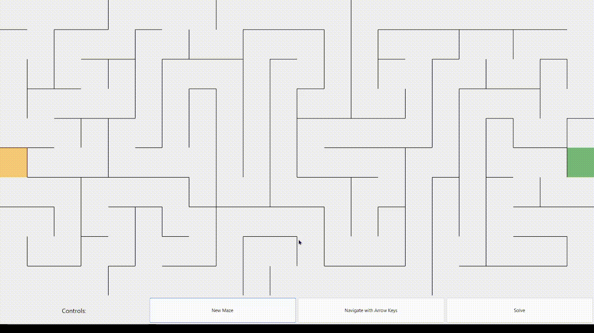

# Maze Generate-inator




This is a .NET 8 WinForms/GDI+ application that can generate a maze, have the user traverse it, and provide a solution.

**This application only runs on Windows as GDI+ is [not supported](https://learn.microsoft.com/en-us/dotnet/core/compatibility/core-libraries/6.0/system-drawing-common-windows-only) for other platforms.**

## Develop

In Visual Studio, simply open the project and run the `Maze.UI` application.

In VS Code:
```
cd ./Maze.UI
dotnet run
```
